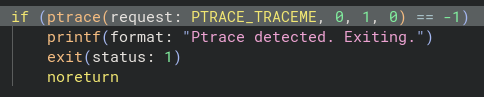
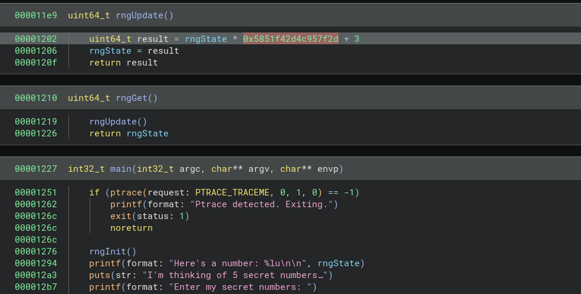
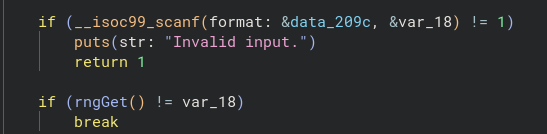

# Writeup for `Guess`

|  author |  category | value |
|---------|-----------|-------|
| Cameron | reversing |  100  |

We cheaped out on our 4.3 billion sided dice, but I'm sure it'll be fine.

## Files

- [guess_handout](guess_handout): An (x86) executable with a redacted FLAG file (the executable with the real flag is run over a netcat connection).

## Solution

<details>
<summary>Click here to reveal the solution!</summary>

### The Big Idea

Just from running the program, we can see that the program expects us to correctly guess 5 numbers in order for something to happen (presumeably, us getting the flag). Our goal is to essentially reverse engineer how these numbers would be generated, correctly guess on the main server and get the flag.

We have a couple of techniques to reverse engineer. First, we could try "dynamic analysis". This involves using a tool, like a debugger, to inspect the state of the program ***while it is running*** (hence, dynamic). Some tools for this include `gdb`, `ltrace` and `strace`. (a debugger, a tool that traces calls to library functions like `printf` and `fgets`, and a tool that traces lower-level "system calls" like `read`, `write` and `mmap`).

Unfortunately, dynamic analysis doesn't work *right away*: if we try running the program with `r` after opening it in `gdb` with `gdb guess_handout`, we get the error message `Ptrace detected. Exiting.`. [Some googling](https://en.wikipedia.org/wiki/Ptrace) shows that `ptrace` is a system call used by debuggers to debug the program.

There's a couple of ways to figure out why this is happening and how to bypass this; one such is **static analysis**, which involves getting information about an executable even before it runs. The easiest way to do this is to use a decompiler: a decompiler is a program that will take an executable, and "guess" the C source code that was used to compile it: two ones I'd highly recommend are Binary Ninja and Ghidra (both are free!). Reading the decompiled source code of the `main` function shows the conditional that triggers the `ptrace` check (I'm using Binary Ninja in the following image):



Interestingly, the `ptrace` syscall is used to check if the `ptrace` syscall is used (by a parent process)! We have a bunch of ways to debug the program from here (there might be something you learn reading this list!):
1. You can patch the conditional statement itself (i.e. change the triggering condition); both Ghidra and Binary Ninja can do this! For Binary Ninja, you can make the conditional always branch (away), and for Ghidra you can patch the `cmp` to check against another number (e.g. `-2`). From here you can perform dynamic analysis to try and figure out/guess how the secret numbers are generated.
2. You can also trick the `ptrace` check dynamically without using static analysis (and from there debug the program dynamically) by either writing a hook in GDB to set a breakpoint before the `ptrace` call and jump over it, or hooking on `ptrace` syscalls with `catch syscall ptrace` and then setting `$rax` to `0`.
3. You can just read the decompiled C source code and figure out what the program is doing.

Option 3 is by far the easiest. Very quickly, we can see a call to `rngUpdate` which changes the 64-bit RNG state with `rngState = rngState * 0x5851f42d4c957f2d + 3` (note that the number is an unsigned 64-bit value so we need to calculate the value mod $2^{64}$), and also realise that the number printed at the beginning of the program was the initial RNG state.




### Walkthrough

1. Connect to the host with `nc pwn.secso.cc 8006`.
2. Obtain the initial number `rngState`.
3. Generate the 5 subsequent numbers, for example as below in Python:
```py
rngState = <initial number printed by program>
for _ in range(5):
    rngState = ((rngState * 0x5851f42d4c957f2d) + 3) % 2**64
    print(rngState, end=" ") 
```
4. Enter the 5 generated numbers into the connection (either one line at a time or all together and space-separated) to obtain the flag.

### Flag(s)

- `RCR{w0w_you_re_v3ry_lucky}`

</details>
