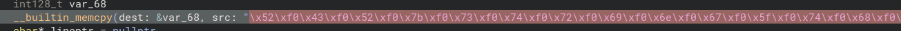
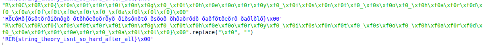

# Writeup for `String Theory`

|  author |  category | value |
|---------|-----------|-------|
| cameron | reversing |  100  |

Just wait until string theorists find out about linked lists.

## Files

- [string_theory](string_theory): A (seemingly obfuscated binary) that takes in our input, perform some operation and spits out a number.

## Solution

Click here to reveal the solution!

### The Big Idea

The premise of this challenge is a pretty big red herring; you can simply figure out what this binary is doing with a decompiler.

Binary Ninja shows that there's a strange string that's being stored in a variable in the `main` function:

If we try and render this text as a literal string, for instance in Python, we see what appears to be our flag but with weird "\xf0" characters separating each letter. Upon removing all instances of this characters, we get the flag:

(The idea behind this challenge was that it could not immediately be solved by checking all readable strings, so you had to actually analyse this binary, if only slightly).

### Walkthrough

As above.

### Flag(s)

- `RCR{string_theory_isnt_so_hard_after_all}`

