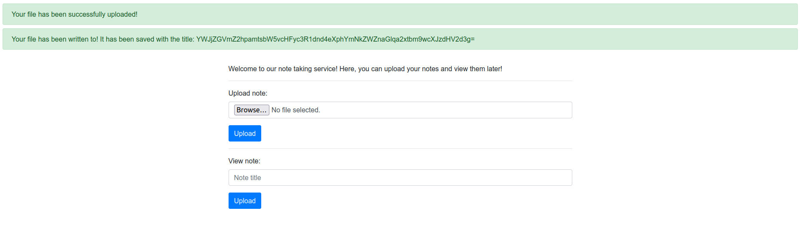
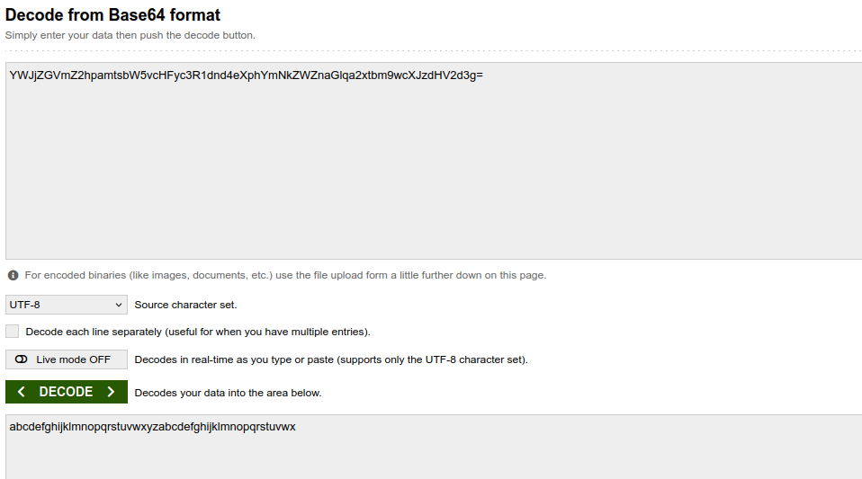
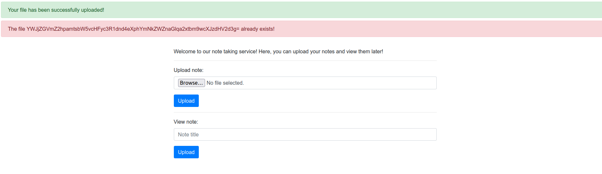
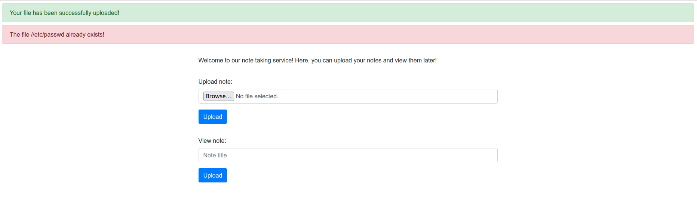
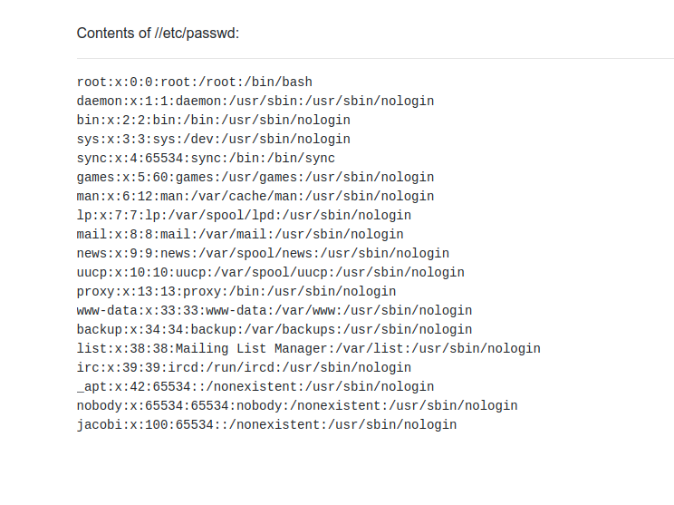
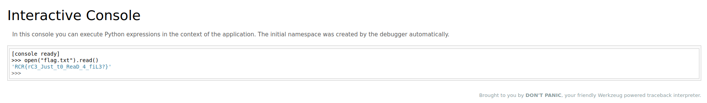

# Writeup for `note-service`

|        author       | category | value |
|---------------------|----------|-------|
| yellowsubmarine1447 |   web    |  100  |

I've heard CSE students take lots of notes during the lectures, so I made this super convenient note taking website!

## Solution

Click here to reveal the solution!

### The Big Idea

There are two main parts to this challenge, the first being to find the (restricted) LFI. When we upload a file on the main page, sometimes, it will be uploaded successfully under a base-64 encoded string:

However, sometimes it will give an "Internal Server Error". This seems to typically happen when the contents of our file contains non-ASCII content (e.g. images) - we'll get back to figuring out why this occurs.

If we try base64-decoding the "title" it was saved to, we see that it's actually the first 50 characters of our file's contents (the file I uploaded contained a repeating sequence of the English lowercase alphabet):

If we try uploading the same file again:

This error message is interesting, as it seems to indicate a *file* with that base64 encoded string as a name (which we only knew was denoted as the title beforehand) doesn't exist. Let's try finding a file that hasn't been uploaded, like `/etc/passwd` (hoping it's a Linux system :P):

Interesting, perhaps we could upload a file that would be saved to this path and then try viewing it? If we look at the possible base64 encoding characters, we see that "/" is one of them - this gives us the idea of possibly retrieving files in a particular directory, e.g. `/etc/passwd`, by treating it as a base64 string, decoding it and writing its contents to the file to be uploaded so that it will be saved to the path we want. This idea of the file name being the title itself would explain why images tended to run into internal server errors; their base64 encodings tend to contain "/"'s, which would direct the write to some non-writeable or non-existent directory.

One caveat is that a base64 encoded string's length must be a multiple of 4 (since every base64 character encodes 6 bits) - this can be fixed by prepending multiple "/"'s, since consecutive "/"'s compresses to just one "/" (e.g. we would decode and visit `//etc/passwd` instead).

`solution.py` has some code to do this with `python3 solution.py visit <file_path>`. Trying with `/etc/passwd`:

Oooh, so this time, the file was "uploaded" for the first time, but already exists on the system. Maybe that means now that it's marked as uploaded, we can view it. Note that if we try viewing `/etc/passwd`, it will once again say the file hasn't been uploaded, however, viewing `//etc/passwd` gives:

Nice! We have an arbitrary file read... kind of. You see, we can only view files that have base64 characters in their file names, so file names with dashes, dots and underscores cannot be read - this means the flag file (`flag.txt`) is not readable (if it even exists). Before we move on, let's try finding out some important file information; `/proc/self/cmdline` will contain the command ran to execute the current process:
`/usr/local/bin/pythonserver.py--boot_id_file./bootid`

This tells us the server is running Python, which indicates the use of some web framework such as Flask or Django. There's also this strange bootid file that's passed as an argument; we'll come back to this :).

We can see that the backend web framework uses Werkzeug, and thus likely Flask, by noticing the `Server` response header that's set to `Werkzeug/3.1.3 Python/3.13.5` whenever we receive a response from the website. This leads us to trying to visit the `/console` page, which is a useful attack vector for Flask applications, and low-and-behold: it's accessible! We are now on the "second part" of this challenge.

The Werkzeug console is locked with an unknown PIN. In turns out, with an LFI vulnerability, you can actually figure out the console PIN by retrieving certain system files; there's various blog posts detailing this, here's one such one: https://www.daehee.com/blog/werkzeug-console-pin-exploit . However, do be warned, as more recent versions of Werkzeug have slight differences in how the PIN is calculated (pertinently, the linked blog uses an MD5 hasher while the most recent version of Werkzeug uses a SHA1 hasher).

If you want to be absolutely sure, you can just copy in the function [here](https://github.com/pallets/werkzeug/blob/main/src/werkzeug/debug/__init__.py#L142) and change the required parts (note this is the most recent version of Werkzeug - ideally you should find the correct version of Python, which I will describe how to do later, and then find the corresponding code repository for Werkzeug). TL;DR we need to manually set the values of `public_bits` and `private_bits` and rerun the function (you can read some writeups of this exploit to figure out these values possible values). A little longer, more detailed read:
- For `public_bits`:
    - The first element is `"jacobi"` (Linux user running server who we found in `/etc/passwd`)
    - The second is `"flask.app"`
    - The third is `"wsgi_app"`
    - The fourth is `"/usr/local/lib/python3.13/site-packages/flask/app.py"` (this is the directory to the Flask app file, we can figure out the exact Python version by viewing `/proc/self/environ` (viewing the contents of this file is also another way you can figure out the backend is running Werkzeug/Flask, as indicated by the `WERKZEUG_SERVER_FD` and `WERKZEUG_RUN_MAIN` env variables this server was run with))
- For `private_bits`:
    - The first element is the numerical value of the MAC address. This can be found by figuring out the correct network interface by viewing `/proc/net/arp` (showing `eth0`), after which we can read `/sys/class/net/eth0/address`, remove the colons and convert the value from a hexadecimal to decimal number
    - The second element is the system's boot ID or machine ID appended with the cgroup ID in `/proc/self/cgroup`. Conveniently, the boot ID is available for us in the `./bootid` file, which we found from `/proc/self/cmdline`! This is accessible through `/proc/self/cwd/bootid` (you can also find the current working directory in `/proc/self/environ`)

`solution.py` also has some code to generate the PIN. You can run `python3 solution.py generate_pin <mac_address_raw> <boot_id_with_cgroup>`. For example, running the challenge locally with Docker, I ran `python3 solution.py generate_pin e2:b7:11:c9:d2:0e 98a98ace-42ab-4545-b6fb-6c6419f897000395e8c40d7238a134ae3ae627e93f68854a3ef623aad6cf578fc4fee6a4a200` to get the PIN `135-521-443`, which works when entered at the `/console` endpoint! From here we can execute whatever Python code we want:

### Walkthrough

As above.

### Flag(s)

- `RCR{rC3_Just_t0_ReaD_4_fiL3?}`

